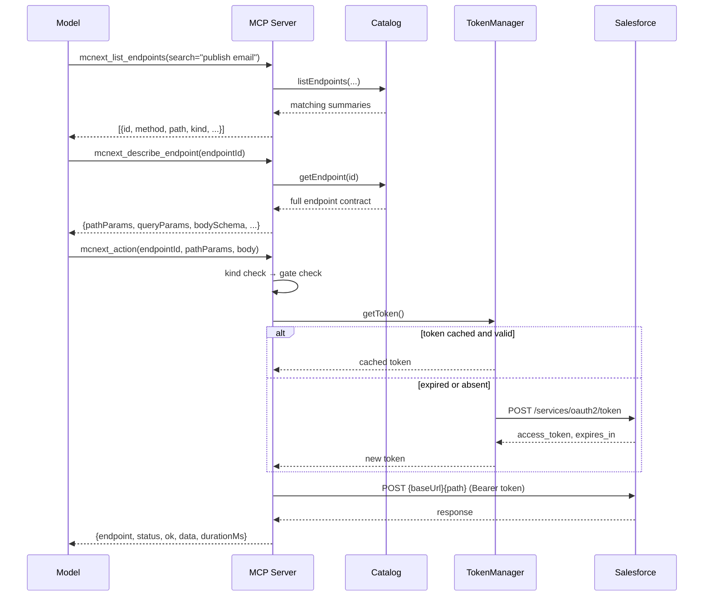

# Architecture

How `mc-next-mcp-server` is put together, and why it is built this way.

For the security model, see [SECURITY.md](../SECURITY.md). For worked examples,
see [EXAMPLES.md](EXAMPLES.md). For the catalog pipeline, see
[POSTMAN-COLLECTIONS.md](POSTMAN-COLLECTIONS.md).

---

## The central design decision

**445 endpoints, 28 tools.**

The server could have exposed one MCP tool per endpoint. It deliberately does not.
Instead, a small set of **generic, catalog-driven** tools lets the model *discover*
an endpoint and then *invoke* it:

```
mcnext_list_endpoints  →  mcnext_describe_endpoint  →  mcnext_query / read / create / update / delete / action
```

### Why not 445 tools

Three reasons, in order of importance:

| Reason | Explanation |
| --- | --- |
| **Context window** | Every tool's name, description, and JSON schema is sent to the model on every turn. 445 verbose tools would consume a large share of the context window before the user even asks a question — and the cost recurs every turn. |
| **Tool-selection accuracy** | Models choose well among a handful of distinct options. With hundreds of near-identical tools (many endpoints differ only by a path parameter), selection accuracy degrades and the model picks wrong ones. |
| **Maintainability** | A catalog regeneration would churn 445 tool definitions. With generic tools, new endpoints appear automatically — no code change at all. |

The trade-off is **one extra round trip**: the model must discover and describe
before invoking. That cost is paid only when the model does not already know the
endpoint id, and the describe call returns exactly the schema needed to build a
correct request.

### Why the platform tools *are* individual

The 20 non-catalog tools (`sf_*`) are discrete because they represent genuinely
distinct operations with different, non-overlapping contracts — a SOQL query is
not a variant of a record read. There is no catalog to drive them, and 20 is well
within a comfortable context budget.

---

## The four tool groups

The 28 tools fall into four groups with different mechanisms.

| Group | Count | Mechanism | Knows about the catalog? |
| --- | --- | --- | --- |
| **Catalog-driven** | 8 | Looks up an endpoint id, then makes an HTTP call | ✅ Yes — this is its whole job |
| **Platform** | 6 | Hardcoded `/services/data/vXX/...` paths on the core org | ❌ No |
| **Record CRUD** | 8 | Salesforce REST + Composite API | ❌ No |
| **Metadata CRUD** | 6 | Tooling API | ❌ No |

### 1. Catalog-driven tools (8)

These are the only tools that understand the catalog.

| Tool | Purpose | Gate |
| --- | --- | --- |
| `mcnext_list_endpoints` | Browse/search the 445 endpoints | — |
| `mcnext_describe_endpoint` | Full contract for one endpoint | — |
| `mcnext_query` | GET a collection (`kind: query`) | — |
| `mcnext_read` | GET one record (`kind: read`) | — |
| `mcnext_create` | POST (`kind: create`) | — |
| `mcnext_update` | PATCH/PUT (`kind: update`) | — |
| `mcnext_delete` | DELETE (`kind: delete`) | 🔒 `ALLOW_DESTRUCTIVE` |
| `mcnext_action` | Non-CRUD ops (`kind: action`) | 🔒 if flagged destructive |

**How discovery works.** `mcnext_list_endpoints` filters by `family`, `group`,
`kind`, `method`, or free-text `search`, and returns a *summary* of each match
(id, family, method, path, name, kind, destructive). It deliberately does **not**
return full schemas — that would blow up the response for a broad query.

`mcnext_describe_endpoint` then returns the full contract for one id: resolved
base URL, path and query parameters, body mode, JSON schema, and a sample body.

**How invocation works.** The verb tools share one internal `invoke()` helper that
performs three checks in order, then delegates to the HTTP client:

```
invoke(id, expectedKinds, opts)
  ├─ 1. getEndpoint(id)            → unknown id? fail with suggestions
  ├─ 2. expectedKinds.includes(?)  → wrong verb? fail with a pointer to describe
  ├─ 3. destructive && !allow      → gate closed? refuse BEFORE any network call
  └─ 4. client.call(endpoint, opts)
```

This is why calling `mcnext_query` on a `create` endpoint produces a clear error
rather than a confusing HTTP 405:

```
Endpoint "content.create-an-email-with-html" is of kind "create"
(POST /connect/cms/contents), which is not valid for this tool.
Expected one of: query. Use mcnext_describe_endpoint to inspect it.
```

**Unknown-id handling.** `suggestEndpoints()` does a normalised, order-independent
fuzzy match (stripping non-alphanumerics and scoring shared prefixes) so a typo
yields the five closest ids instead of a dead end.

### 2. Platform tools (6)

Hardcoded against the **core org** via `SF_INSTANCE_URL`:

`sf_soql_query`, `sf_soql_query_more`, `sf_list_objects`, `sf_describe_object`,
`sf_rest_request`, `sf_org_limits`.

These bypass the catalog entirely. `sf_soql_query` and `sf_describe_object` accept
a `tooling: true` flag to target the Tooling API. `sf_rest_request` is a generic
escape hatch for any `/services/data/...` path — and only gates `DELETE`, which is
an important caveat (see [SECURITY.md](../SECURITY.md#-what-the-gates-do-not-do--read-this)).

### 3. Record CRUD tools (8)

Ported from Salesforce Inspector's Inspect page and batch patterns:

| Tool | Underlying API |
| --- | --- |
| `sf_create_record`, `sf_get_record`, `sf_update_record`, `sf_delete_record` | `/sobjects/{SObject}[/{id}]` |
| `sf_bulk_create_records`, `sf_bulk_update_records`, `sf_bulk_delete_records` | `/composite/sobjects` |
| `sf_composite` | `/composite` |

**Auto-chunking.** The bulk tools accept arbitrarily large `records` arrays and
split them into batches of 200 (`COMPOSITE_LIMIT`) internally, issuing one call
per batch and aggregating the results. They report `requested`, `batches`, and
`succeeded` so the caller can see what happened. `sf_composite` caps at 25
subrequests, which is a Salesforce limit.

**Id validation.** `sf_bulk_delete_records` validates that every id matches
`^[a-zA-Z0-9]{15}([a-zA-Z0-9]{3})?$` (15- or 18-character Salesforce ids) before
sending anything. Single-record tools pass the id straight through and let
Salesforce reject it.

### 4. Metadata CRUD tools (6)

Backed by the **Tooling API**, not the Metadata API:

`sf_create_custom_object`, `sf_create_custom_field`, `sf_delete_custom_object`,
`sf_delete_custom_field`, `sf_list_custom_objects`, `sf_list_custom_fields`.

`sf_create_custom_field` performs **field-type validation** — a `Text` field needs
`length`, a `Currency` field needs both `precision` and `scale`, a `Picklist`
needs a non-empty `picklistValues` array. This validation runs *after* the metadata
gate, so with the gate closed you get the gate refusal, not the validation error.

> **Why the Tooling API and not the Metadata API?** There is no Metadata API
> deploy/retrieve in this server — no `package.xml`, no retrieve/deploy jobs. The
> Tooling API is a different mechanism with different limits. Custom field creation
> is followed by a separate `FieldPermissions` call when field-level security is
> requested.

---

## Request flow

### Full sequence for a catalog-driven call



### The four phases

| Phase | What happens | Failure mode |
| --- | --- | --- |
| **Discover** | Filter the catalog by family/group/kind/method/search | Empty result — the model retries with a broader filter |
| **Describe** | Resolve the full contract, including the base URL | Unknown id — returns fuzzy suggestions |
| **Invoke** | Kind check, gate check, build URL, attach token, send | Kind mismatch or gate refusal, both before any network call |
| **Authenticate** | Reuse the cached token, or fetch one | Actionable OAuth error naming the likely cause |

**Base URL resolution** happens at invoke time. Each endpoint carries a `base` key
(`mcNext` / `data360` / `data360Connect` / `login`) which maps to `cfg.bases`:

```ts
baseUrlFor(endpoint) {
  const base = this.cfg.bases[endpoint.base];
  if (!base) throw new Error(`No base URL configured for "${endpoint.base}" ...`);
  return base;
}
```

**URL construction** substitutes `:pathParams`, rejects leftover `:params`, applies
endpoint-declared query defaults (skipping Postman placeholders), then overlays
caller-supplied query params. Arrays are appended, scalars are set.

---

## Token caching and re-auth

All three API families share **one** token. The `TokenManager` is a small state
machine with three notable behaviours.

```ts
getToken(forceRefresh = false) {
  if (!forceRefresh && cached && Date.now() < cached.expiresAt) return cached.accessToken;
  if (inflight) return inflight;        // de-duplicate concurrent refreshes
  inflight = fetchToken()...;
  return inflight;
}
```

### 1. Proactive expiry skew

Tokens are treated as expiring **60 seconds early** (`EXPIRY_SKEW_MS`):

```ts
expiresAt: Date.now() + Math.max(ttlMs - EXPIRY_SKEW_MS, 30_000)
```

This avoids the race where a token is valid when checked but expires in flight.
The `Math.max(..., 30_000)` floor means a token is never cached for less than 30
seconds, even if Salesforce reports a very short TTL.

### 2. In-flight de-duplication

If several tool calls start simultaneously with no cached token, they would each
fire a token request. The `inflight` promise collapses them into one. A burst of
calls at startup produces **one** token request, not one per call.

### 3. Single transparent re-auth on 401

The HTTP client owns the retry loop:

```ts
if (res.status === 401 && !reauthed) {
  reauthed = true;
  this.tokens.invalidate();
  continue;                    // retry once, immediately
}
```

The `reauthed` flag guarantees **exactly one** retry. If the second attempt also
401s, the error surfaces to the caller rather than looping.

### Retry policy

Independent of auth, retryable statuses are `429`, `500`, `502`, `503`, `504`:

- Honours a numeric `Retry-After` header when present.
- Otherwise exponential backoff: `min(2^attempt * 500ms, 15s)`.
- Bounded by `MC_NEXT_MAX_RETRIES` (default 3).

Non-retryable errors (400, 403, 404, …) return immediately.

### Token lifecycle summary

| Property | Value |
| --- | --- |
| Storage | In memory only — never persisted |
| Lifetime | Salesforce-defined (~2h typical) |
| Refresh | Proactively, 60s before expiry |
| On 401 | One invalidate + retry |
| On restart | Cold start, always re-authenticated |
| Concurrency | De-duplicated |

---

## The two hosts

This is the single most important thing to understand about the server. It spans
**two different Salesforce hosts**, and confusing them is the most common
configuration error.

```
                        ┌──────────────────────────────────────┐
   one OAuth token ───► │  login.salesforce.com                │
   shared by every      │  SF_LOGIN_URL                        │
   API family           │  POST /services/oauth2/token         │
                        └──────────────────────────────────────┘
                                        │
        ┌───────────────────────────────┴───────────────────────────────┐
        │                                                               │
        ▼                                                               ▼
┌──────────────────────────┐                    ┌──────────────────────────────────┐
│  CORE ORG HOST           │                    │  DATA 360 TENANT HOST            │
│  my-org.my.salesforce.com│                    │  my-tenant.c360a.salesforce.com  │
│                          │                    │                                  │
│  MC_NEXT_API_BASE_URL    │                    │  DATA360_TENANT_URL              │
│  SF_INSTANCE_URL         │                    │  DATA360_CONNECT_BASE_URL        │
│                          │                    │                                  │
│  ┌────────────────────┐  │                    │  ┌────────────────────────────┐  │
│  │ mc-next       (27) │  │                    │  │ data360            (35)    │  │
│  ├────────────────────┤  │                    │  ├────────────────────────────┤  │
│  │ sf_* platform      │  │                    │  │ data360-connect   (383)    │  │
│  │ sf_* record CRUD   │  │                    │  │                            │  │
│  │ sf_* metadata CRUD │  │                    │  │                            │  │
│  └────────────────────┘  │                    │  └────────────────────────────┘  │
└──────────────────────────┘                    └──────────────────────────────────┘
```

### Why two hosts exist

**Marketing Cloud Next lives on your core org.** Its API is served from your
instance URL, alongside the standard Salesforce REST API. So the CMS endpoints,
the platform tools, the record CRUD tools, and the metadata tools all talk to
*the same host*.

**Data 360 lives on a separate tenant host.** A Data 360 tenant is provisioned on
its own `c360a` hostname, distinct from the core org. Data 360 and Data 360
Connect endpoints therefore go somewhere else entirely.

Consequences:

| Consequence | Detail |
| --- | --- |
| **Two base URL families** | `mcNext` + `login` are core-org; `data360` + `data360Connect` are tenant |
| **`sf_rest_request` cannot reach Data 360** | It only targets the core org. There is no generic passthrough for the tenant hosts. |
| **A wrong host looks like a permission error** | Pointing `DATA360_TENANT_URL` at `my.salesforce.com` yields confusing 403/404s, not an obvious "wrong host" error |
| **Two separate scope sets** | CMS scope vs. `cdp_*` scopes — see [the scope table](SALESFORCE-CONNECTED-APP-GUIDE.md#scope--capability-mapping) |

### The `base` key indirection

Endpoints do not hardcode URLs. Each carries a `base` key resolved at runtime:

| `base` key | Env var | Suffix rule |
| --- | --- | --- |
| `mcNext` | `MC_NEXT_API_BASE_URL` | **includes** `/services/data/vXX` |
| `data360` | `DATA360_TENANT_URL` | **no** suffix (bare host) |
| `data360Connect` | `DATA360_CONNECT_BASE_URL` | **includes** `/services/data/vXX` |
| `login` | `SF_LOGIN_URL` | bare host |

Note the asymmetry: `data360` is a bare host while `data360Connect` includes the
API path. That is why there are two environment variables for what is physically
the same tenant.

### Request routing

```
endpoint.base ──► cfg.bases[key] ──► base URL ──► + endpoint.path
```

The client never inspects the host to decide routing; it trusts the catalog's
`base` key. That keeps routing data-driven, so a new family only needs a catalog
entry plus a config value.

---

## Tool registry and code structure

### Module layout

| File | Responsibility |
| --- | --- |
| `index.ts` | Entrypoint: config, catalog, token manager, client, tool registration, resources, prompts, stdio transport |
| `config.ts` | Environment parsing, defaults, validation helpers (`missingCredentials`, `unconfiguredBases`), `log()` |
| `auth.ts` | `TokenManager` — caching, expiry skew, de-dup, refresh |
| `catalog.ts` | Catalog loading, `getEndpoint`, `listEndpoints`, `suggestEndpoints`, `summarize`, `groupsFor` |
| `client.ts` | HTTP client — base resolution, URL building, body building, retries, re-auth |
| `sfrest.ts` | Shared Salesforce REST client used by `platform`, `records`, `metadata` |
| `tools.ts` | The 8 catalog-driven tools + the shared `invoke()` helper |
| `platform.ts` | The 6 platform tools |
| `records.ts` | The 8 record CRUD tools + `chunk()` |
| `metadata.ts` | The 6 metadata tools + field-type validation |

### Registration is a function-per-group

Each group exports a `register*` function taking the same three dependencies:

```ts
// index.ts
const tokens = new TokenManager(cfg);
const client = new McNextClient(cfg, tokens);

registerTools(server, cfg, client);          // catalog-driven
registerPlatformTools(server, cfg, tokens);  // platform
registerRecordTools(server, cfg, tokens);    // record CRUD
registerMetadataTools(server, cfg, tokens);  // metadata
```

Note the split: the catalog-driven group needs the **client** (to resolve base
URLs and make catalog calls), while the other three need the **token manager**
directly (they build their own REST calls via `sfrest.ts`).

### The registration idiom

Every tool follows the same shape:

```ts
server.registerTool(
  'tool_name',                    // name is the FIRST argument
  {
    title: '...',
    description: '...',           // written for model selection
    inputSchema: { param: z.string().describe('...') },
  },
  async (args) => { /* ... */ }
);
```

Two conventions matter:

- **`registerTool` takes the name as the first argument.** Passing only an options
  object can compile under a cast but fails at runtime.
- **`inputSchema` uses Zod**, and each field carries a `.describe()` — these
  descriptions are what the model reads to build arguments. They are user-facing
  documentation, not internal notes.

### Result formatting

Two helpers shape every response:

- `ok(payload)` — JSON-stringified text content.
- `fail(message)` — same shape, with `isError: true`.

Catalog calls pass through `formatResult()`, which produces a compact envelope and
attaches a **status-specific hint**:

```json
{
  "endpoint": "content.create-an-email-with-html",
  "family": "mc-next",
  "request": "POST https://.../connect/cms/contents",
  "status": 403,
  "ok": false,
  "hint": "Forbidden — the Connected App or user may lack the required scope for this API family (e.g. sfdc_cms_api, cdp_query_api)."
}
```

Hints exist for 400, 401, 403, 404, 405, 429, and 5xx. This is why a failed call
usually tells the model what to do next instead of requiring the user to
interpret a bare status code.

### Resources and prompts

Beyond tools, the server exposes:

| Kind | Name | Content |
| --- | --- | --- |
| Resource | `mcnext://catalog` | The full catalog as JSON |
| Resource | `mcnext://overview` | Auth model, bases, stats, and current configuration state |
| Prompt | `explore-mc-next` | Guided workflow: list → describe → invoke |
| Prompt | `explore-salesforce-org` | Guided workflow: list objects → describe → SOQL → limits |

`mcnext://overview` is useful for debugging: it reports whether credentials are
configured and whether any base URL is still at its placeholder default.

---

## Catalog generation and validation

Full detail lives in [POSTMAN-COLLECTIONS.md](POSTMAN-COLLECTIONS.md); this is the
architectural summary.

### Pipeline

```
Postman collections ──► scripts/generate-catalog.mjs ──► catalog/endpoints.json
   (not in repo)              transform + classify             (committed, ~1 MB)
                                      │
                                      └──► scripts/audit-catalog.mjs (fidelity checks)
```

### What the generator does

1. Reads three Postman collections (paths overridable via argv).
2. For each request: classifies `kind` from method + path, resolves the `base` key
   via longest-prefix host matching, infers a JSON schema from the sample body,
   and determines `destructive`.
3. Emits a catalog with `api` metadata, `stats`, `groups`, and `endpoints`.

Key classification functions:

| Function | Purpose |
| --- | --- |
| `classify(method, path)` | → `query` / `read` / `create` / `update` / `delete` / `action` |
| `isDestructive(method, path, actionName)` | → the `destructive` flag (63 endpoints) |
| `resolveBaseKey(hostTemplate, hostMap, fallback)` | → longest-prefix host match |
| `inferSchema(value, depth)` | → JSON schema from a sample body |
| `parseRawBody(raw)` | → parsed body, or a typed non-JSON marker |

### What the audit validates

`scripts/audit-catalog.mjs` runs nine checks and reports by severity:

| Check | Severity |
| --- | --- |
| Unresolved `{{placeholders}}` in paths | HIGH |
| Duplicate endpoint ids | HIGH |
| Path-param mismatches | HIGH |
| `DELETE` endpoints not classified as `delete` | HIGH |
| Endpoints referencing unknown base keys | HIGH |
| Raw bodies that failed to parse | MED |
| Array schemas with no item shape | LOW |
| Endpoints with no description | LOW |

Current output:

```
endpoints: 445  groups: 44  destructive: 63
byKind: {"query":122,"create":115,"read":80,"update":45,"delete":45,"action":38}
byFamily: {"mc-next":27,"data360":35,"data360-connect":383}

1 issue(s):
  [LOW] 25 array schemas have no item shape
```

The single LOW is expected — those are genuinely empty sample arrays in the source
collections.

> **Known gap:** the catalog declares `"$schema": "./catalog.schema.json"`, but
> that schema file is **not present** in the repository. The reference is
> currently unresolvable. The audit does not validate against it.

---

## Constraints and trade-offs

### Deliberate constraints

| Constraint | Why |
| --- | --- |
| **stdio transport only** | No port to secure; simplest possible trust model. Costs the ability to host it as a shared remote service. |
| **Client-credentials auth only** | Works unattended. Costs per-user identity and impersonation. |
| **One org per instance** | Base URLs fixed at startup. Costs runtime multi-org switching. |
| **No response caching** | Always-fresh data. Costs an API request per call, including repeated describes. |
| **No token persistence** | Nothing sensitive on disk. Costs a re-auth on every restart. |
| **No pagination helper for catalog tools** | The model follows cursors itself. Only SOQL has `sf_soql_query_more`. |

### Known limitations

Cross-referenced rather than duplicated:

| Limitation | Where |
| --- | --- |
| Auth model, identity, single-org | [SECURITY.md](../SECURITY.md#authentication) |
| Safety-gate coverage and gaps | [SECURITY.md](../SECURITY.md#safety-gates) |
| No GraphQL / SOAP / Bulk API 2.0 / Metadata API | [README.md](../README.md#limitations) |
| Catalog gaps in the source collections | [POSTMAN-COLLECTIONS.md](POSTMAN-COLLECTIONS.md#known-gaps-in-the-collections) |
| Operational constraints (rate limits, caching) | [DEPLOYMENT-GUIDE.md](DEPLOYMENT-GUIDE.md#monitoring) |
| No live-org tests in CI | [README.md](../README.md#limitations) |

### The trade-off table

| Decision | Gained | Given up |
| --- | --- | --- |
| 8 generic tools over 445 | Context budget, selection accuracy, auto-coverage | One extra discovery round trip |
| Data-driven `base` keys | New families need no code | Host errors surface as permission errors |
| Two independent gates | Schema changes protected separately | More config to get right |
| Auto-chunking bulk tools | No caller-side batching | Partial success needs careful reading |
| Tooling API for metadata | Simpler than Metadata API deploy | No `package.xml` deploy/retrieve |

---

## See also

- [EXAMPLES.md](EXAMPLES.md) — worked examples with real tool output
- [POSTMAN-COLLECTIONS.md](POSTMAN-COLLECTIONS.md) — the catalog pipeline in depth
- [SECURITY.md](../SECURITY.md) — threat model and trust boundaries
- [CONTRIBUTING.md](../CONTRIBUTING.md) — module conventions and safety invariants
